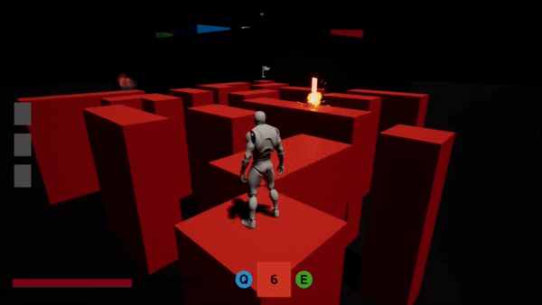

# GE-Project_Team3

</img>
</img>

퍼즐을 풀고 보스를 처치하는 게임입니다.

# Download
[다운로드 링크](https://drive.google.com/file/d/1IId4Ihhj1zkCqFeQtAvk97L9VCSRXlDs/view)

# Control
이동 : w, a, s, d  
대시 : shift  
색상변경 : 1, 4  
아이템박스 상호작용 : e  
인벤토리 : i  
점프 : spacebar (어빌리티 장착 후 사용가능)  
점멸 : alt (어빌리티 장착 후 사용가능)  
